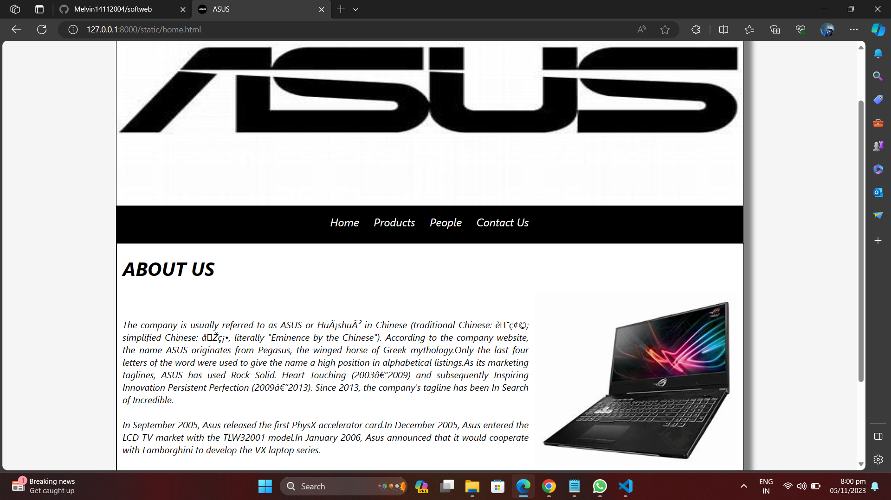
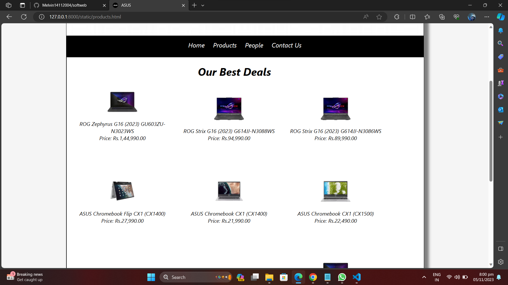
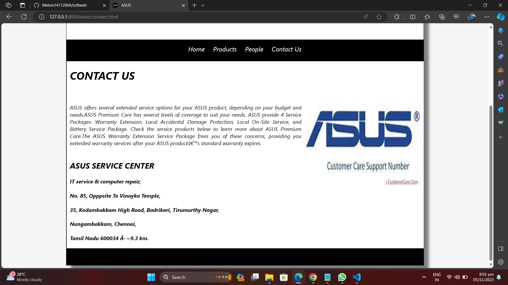

# Ex.07 Software Product Company Website

## DATE:17.10.23

## AIM:
To develop a static company website to display the softwares and services provided by the company.

## DESIGN STEPS:

### Step 1:
Requirement collection.

### Step 2:
Creating the layout using HTML and CSS.

### Step 3:
Updating the sample content.

### Step 4:
Choose the appropriate style and color scheme.

### Step 5:
Validate the layout in various browsers.

### Step 6:
Validate the HTML code.

### Step 7:
Publish the website in the given URL.

## PROGRAM:

## CSS CODE:

```css
* {
    box-sizing: content-box;
    font-family: -apple-system, BlinkMacSystemFont, 'Segoe UI', Roboto, Oxygen, Ubuntu, Cantarell, 'Open Sans', 'Helvetica Neue', sans-serif;
    font-style: italic
    ;
  }
  body {
    background-color: whitesmoke;
    color: black;
  
  }
  .container {
    width: 1080px;
    margin-left: auto;
    margin-right: auto;
    border-width: 1px 1px 1px 1px;
    border-style: solid;
    box-shadow: 15px 15px 8px gray;
  }
  
  .banner {
      
    display: block;
    width: 100%;
    height: 250px;
    text-align: center;
    font-size: 60px;
    background-image: url("/static/img/th.jpg");
    background-size: 100% 100%;
    margin: 0px 0px 0px 0px;
    padding-top: 150px;
    color: #ffffff;
    
  }
  
  .menu {
    display: block;
    width: 100%;
    height: 50px;
    font-size: larger;
    background-color:black;
    text-align: center;
    padding-top: 15px;
    margin: 0px 0px 0px 0px;
    border-width: 1px;
  }
  
  .menuitem {
    display: inline-block;
    margin-left: 10px;
    margin-right: 10px;
  }
  .menuitemselected {
    display: inline-block;
    margin-left: 10px;
    margin-right: 10px;
    color: #ffffff;
  }
  
  .menuitem a {
    text-decoration: none;
    color: white;
  }
  
  .content {
    display: block;
    width: 100%;
    background-color: #ffffff;
    min-height: 500px;
    margin: 0px 0px 0px 0px;
    border-width: 1px;
    border-color: rgb(0, 0, 0);
    border-style: solid;
  }
  .homecontent {
    min-height: 500px;
    margin: 10px 10px 10px 10px;
  }
  .homecontent h1 {
    text-align: left;
  }
  .homecontent img {
    float: right;
    width: 350px;
    height: 300px;
    margin-left: 10px;
  }
  
  .contenttext {
    text-align: justify;
  }
  
  .productcontent {
    min-height: 500px;
    margin: 10px 10px 10px 10px;
  }
  
  .productcontent h1 {
    text-align: left;
  }
  
  .productitems {
    display: block;
  }
  
  .productitem {
    display: inline-block;
    width: 30%;
    height: 250px;
    text-align: center;
  }
  
  .productitem img {
    width: 100px;
    height: 100px;
    display: block;
  }
  .productitem .itemimage {
    display: block;
    margin-left: auto;
    margin-right: auto;
    width: 100px;
    margin-bottom: 5px;
  }
  
  .productitem .itemname {
    display: block;
  }
  .productitem .itemprice {
    display: block;
  }
  
  .footer {
    display: block;
    width: 100%;
    height: 40px;
    background-color: #000000;
    text-align: center;
    padding-top: 10px;
    margin: 0px 0px 0px 0px;
    color: #ffffff;
  }
  
```
## HOME PAGE HTML CODE:

```html
<!DOCTYPE html>
<html lang="en">
  <head>
    <title>ASUS</title>
    <link rel="stylesheet" href="./css/layout.css" />
    <link rel="icon" href="./img/icon.png" type="image/x-icon" />
  </head>

  <body>
    <div class="container">
        <div class="banner"></div>

      <div class="menu">
        <div class="menuitem"><a href="/static/home.html">Home</a></div>
        <div class="menuitem"><a href="/static/products.html">Products</a></div>
        <div class="menuitem"><a href="/static/people.html">People</a></div>
        <div class="menuitem"><a href="/static/contact.html">Contact Us</a></div>
      </div>
      <div class="content">
        <div class="homecontent">
          <h1>ABOUT US</h1>
          
          <div class="contenttext"><br><br>
            The company is usually referred to as ASUS or Huáshuò in Chinese (traditional Chinese: 華碩; simplified Chinese: 华硕, literally "Eminence by the Chinese"). According to the company website, the name ASUS originates from Pegasus, the winged horse of Greek mythology.Only the last four letters of the word were used to give the name a high position in alphabetical listings.As its marketing taglines, ASUS has used Rock Solid. Heart Touching (2003–2009) and subsequently Inspiring Innovation Persistent Perfection (2009–2013). Since 2013, the company's tagline has been In Search of Incredible.
           <br><br>
           In September 2005, Asus released the first PhysX accelerator card.In December 2005, Asus entered the LCD TV market with the TLW32001 model.In January 2006, Asus announced that it would cooperate with Lamborghini to develop the VX laptop series.
            <br><br>
            <ul>
              <li>OFFER BEST DISCOUNT</li>
              <li>BEST QUALITY !</li>
              <li>5 YEARS WARRANTY</li>
            </ul>
          </div>
        </div>
      </div>
      <div class="footer">
      </div>
    </div>
  </body>
</html>
```

## PRODUCTS PAGE HTML CODE:

```html
<!DOCTYPE html>
<html lang="en">
  <head>
    <title>ASUS</title>
    <link rel="stylesheet" href="./css/layout.css" />
    <link rel="icon" href="./img/icon.png" type="image/x-icon" />
  </head>

  <body>
  <div class="container">
           <div class="banner"></div>

      <div class="menu">
        <div class="menuitem"><a href="/static/home.html">Home</a></div>
        <div class="menuitem"><a href="/static/products.html">Products</a></div>
        <div class="menuitem"><a href="/static/people.html">People</a></div>
        <div class="menuitem"><a href="/static/contact.html">Contact Us</a></div>
      </div>
      <div class="content">
        <div class="productcontent">    
          <h1>&nbsp&nbsp&nbsp&nbsp&nbsp&nbsp&nbsp&nbsp&nbsp&nbsp&nbsp&nbsp&nbsp&nbsp&nbsp&nbsp&nbsp&nbsp&nbsp&nbsp&nbsp&nbsp&nbsp&nbsp&nbsp&nbsp&nbsp&nbsp&nbsp&nbsp&nbsp&nbsp&nbsp&nbsp&nbsp&nbsp&nbsp&nbsp&nbsp&nbsp&nbsp&nbsp&nbsp&nbspOur Best Deals</h1>
          <div class="productitems">
              <div class="productitem"> 
                  <div class="itemimage">
                  
                  </div>
                  <div class="itemname">ROG Zephyrus G16 (2023)
                    GU603ZU-N3023WS</div>
                  <div class="itemprice">Price: Rs.1,44,990.00 </div>
              </div>
              <div class="productitem"> 
                  <div class="itemimage">
                  
                  </div>
                  <div class="itemname">ROG Strix G16 (2023)
                    G614JJ-N3088WS</div>
                  <div class="itemprice">Price: Rs.94,990.00 </div>
              </div>
               <div class="productitem"> 
                  <div class="itemimage">
                  
                  </div>
                  <div class="itemname">ROG Strix G16 (2023)
                    G614JJ-N3086WS</div>
                  <div class="itemprice">Price: Rs.89,990.00 </div>
              </div>
              <div class="productitem"> 
                  <div class="itemimage">
                  
                  </div>
                  <div class="itemname">ASUS Chromebook Flip CX1 (CX1400)</div>
                  <div class="itemprice">Price: Rs.27,990.00 </div>
              </div>
              <div class="productitem"> 
                  <div class="itemimage">
                  
                  </div>
                  <div class="itemname">ASUS Chromebook CX1 (CX1400)</div>
                  <div class="itemprice">Price: Rs.21,990.00 </div>
              </div>
              <div class="productitem"> 
                <div class="itemimage">
                
                </div>
                <div class="itemname">ASUS Chromebook CX1 (CX1500)</div>
                <div class="itemprice">Price: Rs.22,490.00 </div>
            </div>
            <div class="productitem"> 
              <div class="itemimage">
              
              </div>
              <div class="itemname">ROG Flow X13 (2022)
                GV301RC-LJ132WS</div>
              <div class="itemprice">Price: Rs.94,990.00 </div>
          </div>
          <div class="productitem"> 
            <div class="itemimage">
            
            </div>
            <div class="itemname">ROG Flow X13 (2022)
              GV301RC-LJ022WS</div>
            <div class="itemprice">Price: Rs.94,990.00 </div>
        </div>
        <div class="productitem"> 
          <div class="itemimage">
          
          </div>
          <div class="itemname">ROG Zephyrus G14 (2023)
            GA402NJ-L8094WS</div>
          <div class="itemprice">Price: Rs.1,19,990.00 </div>
      </div>
      <div class="productitem"> 
        <div class="itemimage">
        
        </div>
        <div class="itemname">ROG Zephyrus G14
          GA401II-HE127TS</div>
        <div class="itemprice">Price: Rs.62,990.00 </div>
    </div>
    <div class="productitem"> 
      <div class="itemimage">
      
      </div>
      <div class="itemname">ROG Zephyrus G14 (2023)
        GA402XZ-N2020WS</div>
      <div class="itemprice">Price: Rs.2,66,990.00 </div>
  </div>
  <div class="productitem"> 
    <div class="itemimage">
    
    </div>
    <div class="itemname">ROG Zephyrus G14 (2023)
      GA402XZ-N2019WS</div>
    <div class="itemprice">Price: Rs.2,56,990.00 </div>
</div>
          </div>
          </div>        
      </div>
      <div class="footer">
      </div>
    </div>
  </body>
</html>

```

## PEOPLE PAGE HTML CODE:

```html
<!DOCTYPE html>
<html lang="en">
  <head>
    <title>ASUS</title>
    <link rel="stylesheet" href="./css/layout.css" />
    <link rel="icon" href="./img/icon.png" type="image/x-icon" />
  </head>

  <body>
 <div class="container">
     <div class="banner"></div>
      <div class="menu">
        <div class="menuitem"><a href="/static/home.html">Home</a></div>
        <div class="menuitem"><a href="/static/products.html">Products</a></div>
        <div class="menuitem"><a href="/static/people.html">People</a></div>
        <div class="menuitem"><a href="/static/contact.html">Contact Us</a></div>
      </div>
      <div class="content">
        <div class="productcontent">    
          <h1>&nbsp&nbsp&nbsp&nbsp&nbsp&nbsp&nbsp&nbsp&nbsp&nbsp&nbsp&nbsp&nbsp&nbsp&nbsp&nbsp&nbsp&nbsp&nbsp&nbsp&nbsp&nbsp&nbsp&nbsp&nbsp&nbsp&nbsp&nbsp&nbsp&nbsp&nbsp&nbsp&nbsp&nbsp&nbspDESIGNATIONS OF PEOPLES</h1>
          <div class="productitems">
              <div class="productitem"> 
                  <div class="itemimage">
                  
                  </div>
                  <div class="itemname">
                    Jonney Shih</div>
                  <div class="itemprice">CHAIRMAN</div>
              </div>
              <div class="productitem"> 
                  <div class="itemimage">
                  
                  </div>
                  <div class="itemname">Ted Hsu</div>
                  <div class="itemprice">VICE CHAIRMAN</div>
              </div>
               <div class="productitem"> 
                  <div class="itemimage">
                  
                  </div>
                  <div class="itemname">Jonathan Tsang</div>
                  <div class="itemprice">PRESIDENT, ASUS GROUP</div>
              </div>
              <div class="productitem"> 
                  <div class="itemimage">
                  
                  </div>
                  <div class="itemname">S.Y. Hsu</div>
                  <div class="itemprice">ASUS co-CEO</div>
              </div>
              <div class="productitem"> 
                  <div class="itemimage">
                  
                  </div>
                  <div class="itemname">
                    Samson Hu</div>
                  <div class="itemprice">ASUS co-CEO</div>
              </div>
          </div>
          </div>        
      </div>
      <div class="footer">
      </div>
    </div>
  </body>
</html>

```

## CONTACT PAGE HTML CODE:

```html
<!DOCTYPE html>
<html lang="en">
  <head>
    <title>ASUS</title>
    <link rel="stylesheet" href="./css/layout.css" />
    <link rel="icon" href="./img/icon.png" type="image/x-icon" />
  </head>

  <body>
    <div class="container">
        <div class="banner"></div>

      <div class="menu">
        <div class="menuitem"><a href="/static/home.html">Home</a></div>
        <div class="menuitem"><a href="/static/products.html">Products</a></div>
        <div class="menuitem"><a href="/static/people.html">People</a></div>
        <div class="menuitem"><a href="/static/contact.html">Contact Us</a></div>
      </div>
      <div class="content">
        <div class="homecontent">
          <h1>CONTACT US</h1>
          
          <div class="contenttext"><br><br>
            ASUS offers several extended service options for your ASUS product, depending on your budget and needs.ASUS Premium Care has several levels of coverage to suit your needs. ASUS provide 4 Service Packages: Warranty Extension, Local Accidental Damage Protection, Local On-Site Service, and Battery Service Package. Check the service products below to learn more about ASUS Premium Care.The ASUS Warranty Extension Service Package frees you of these concerns, providing you extended warranty services after your ASUS product’s standard warranty expires.
 
           <br><br>
         <h2>ASUS SERVICE CENTER</h2>
            <h4>IT service & computer repair,</h4>
            <h4>No. 85, Opppsite To Vinayka Temple,</h4>
            <h4>35, Kodambakkam High Road, Badrikari, Tirumurthy Nagar,</h4>
            <h4> Nungambakkam, Chennai,</h4>
            <h4>Tamil Nadu 600034 · ~9.3 km.</h4>

          </div>
        </div>
      </div>
      <div class="footer">
      </div>
    </div>
  </body>
</html>

```
## OUTPUT:






## RESULT:
The program for designing software company website using HTML and CSS is completed successfully.
